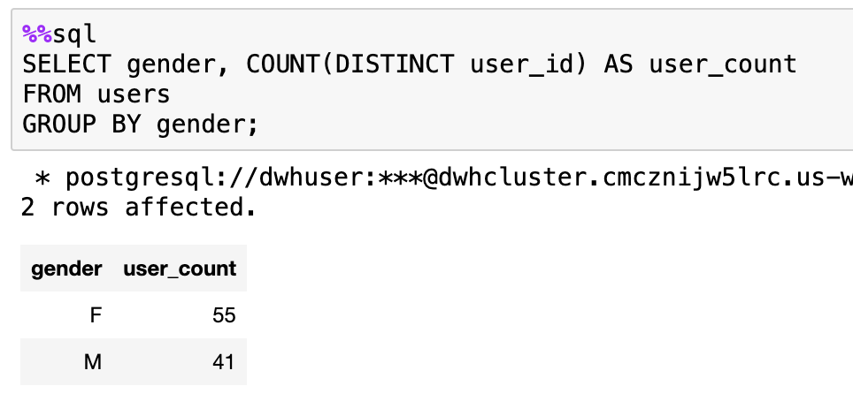
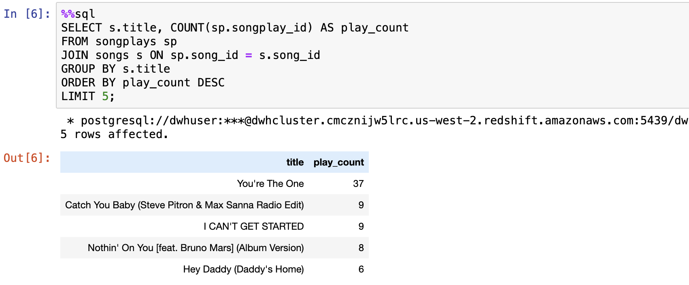
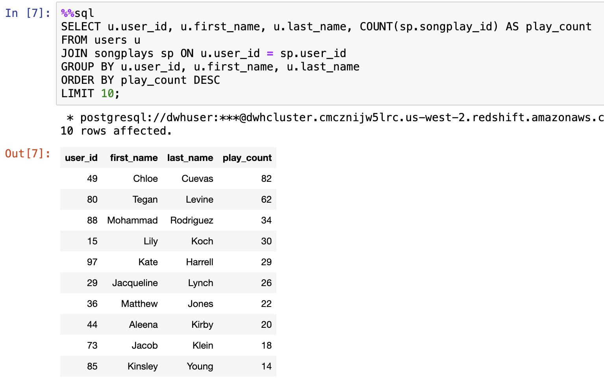
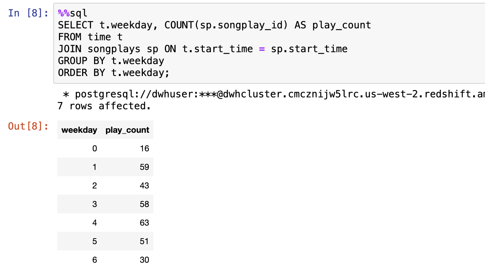
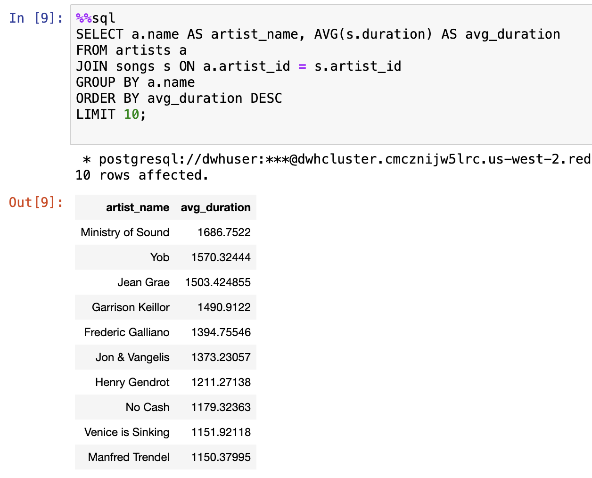

# Sparkify Data Warehouse ETL

Building a data warehouse for Sparkify database on AWS Redshift


## Description

This project utilize the knowledge of data warehouses and AWS to construct an ETL (Extract, Transform, Load) pipeline for a database hosted on Redshift. The task here involved transferring data from S3 to staging tables on Redshift and implementing SQL statements to generate analytics tables based on the information stored in these staging tables.

## The Process and the Insight
Sparkify, a burgeoning music streaming startup, has expanded both its user base and song database. The company is now aiming to transition its operations and data to the cloud. Currently, their data is stored in an S3 repository, encompassing a directory of JSON logs detailing user activity on the application, along with another directory containing JSON metadata pertaining to the songs featured in their platform.

In my role as the data engineer, I am to construct an ETL pipeline. This pipeline involves retrieving their data from S3, placing it into Redshift staging, and converting the data into a collection of dimensional tables. These tables will facilitate the analytics team in ongoing efforts to uncover insights into the music preferences of their user base.  

  

### Detasets
Here are the S3 links for each raw dataset:
Song data: s3://udacity-dend/song_data
Log data: s3://udacity-dend/log_data

### Database tables created and description.
Utilizing the datasets for songs and events, I constructed a star schema optimized for querying song play analysis. This involves creating the following tables:

**Fact Table**  
* `songplays`: Records in the event data linked to song plays, specifically those with the "NextSong" page.  
**Columns**: songplay_id, start_time, user_id, level, song_id, artist_id, session_id, location, user_agent  

**Dimension Tables**
* `users`: Information about users in the app.  
**Columns**: user_id, first_name, last_name, gender, level
* `songs`: Details about songs in the music database.  
**Columns**: song_id, title, artist_id, year, duration
* `artists`: Information about artists in the music database.  
**Columns**: artist_id, name, location, latitude, longitude
* `time`: Timestamps of records in songplays broken down into specific units.  
**Columns**: start_time, hour, day, week, month, year, weekday

### Project files and descriptions
The project  comprises four major files:

* `create_tables.py`: This is where I generated the fact and dimension tables for the star schema in Redshift.  
* `etl.py`: This is the file where I loaded data from S3 into staging tables on Redshift. Subsequently, the data will be processed into analytics tables on Redshift.  
* `sql_queries.py`: In this file, I defined my SQL statements. These statements will be imported into the two files mentioned above.  
* `dwh.md`: Location of the credentials.  

## Getting Started

### Dependencies

* There are simple prerequisites to running this project. The python package requirements is psycopg2 and boto3. Most OS can run this project including Mac, Windows, Linux
* ex. Mac

### Installing Dependencies (Assuming posix systems)

* Install the dependencies with pip
```bash
pip install -r requirements.txt
```
* Modification to be made before running the project. You must ensure you have already setup a running redshift cluster on AWS and update the dwh.cfg file with the cluster credentials. These include:
```sh
[CLUSTER]
HOST=<cluster host>
DB_NAME=<cluster db name>
DB_USER=<cluster db user>
DB_PASSWORD=<cluster db password>
DB_PORT=5439

[IAM_ROLE]
ARN=<amazon role name>
...
```

### Executing program

* First the tables need to be created on redshift by running the command
```bash
python3 create_tables.py
```
* Secondly loading the tables with data running the command
```sh
python3 etl.py
```

### Example queries and results for song play analysis
Some queries and analysis done on the database
* Get the number of users by gender:
    
* Find the top 5 songs played along with their play counts:
    
* Identify the top 10 most active users by the number of song plays:
  
* Determine the distribution of song plays across different days of the week:  
   
* Find the top 10 average song duration by artist:  
   

You can run the queries and analysis in the notebook file ([analytics.ipynb](analytics.ipynb))  

The [outout.txt](outout.txt) file contains the terminal output when you run the program from the ipython terminal 

## Authors

## License

